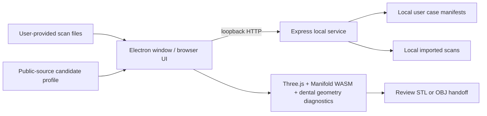

# procad architecture and current boundary

procad is a local desktop wrapper around a loopback web application. The renderer owns the interactive 3D scene and review controls. The local service owns user-provided file intake, SHA-256 provenance, case JSON, self-attested review records, and review-proposal persistence. There are no bundled scans, built-in cases, or automatic private dataset paths.

The importer accepts STL/PLY/OBJ/OFF surface meshes and XYZ/PTS/CSV/ASCII PCD point clouds. Units are user-declared and normalized to millimetres. Point clouds are view-only. Version 2 case records preserve source paths, hashes, units, transforms, operator margin points, an unsigned-distance summary, design parameters, and any generated review mesh; they do not preserve the per-sample distance points used to render the transient color overlay. Version 1 cases remain readable and load without a margin trace.

The current geometry operation requires a closed, consistently wound preparation and a manually closed operator annotation bound to that preparation's SHA-256. The annotation consists of picked surface points joined by piecewise-linear 3D chords; the interpolation and construction boundary are not constrained to follow the preparation surface between points. It must form a simple radial loop in the current XY frame and drives the lower boundary of a generic parametric envelope. It is a construction proxy, not a true surface-following or clinically verified finish-line trace. The prep offset is subtracted with Manifold; invalid offset geometry stops generation. It is still a one-crown engineering preview, not tooth-specific anatomy. A separate diagnostic area-samples the prep surface and reports unsigned nearest distances to the resulting preview mesh; an opposed-normal subset is only a heuristic, not a validated intaglio classifier or fit assessment. Only the diagnostic summary is saved; the sample points used for the transient color overlay are not persisted. Restore checks the distance algorithm and geometry-engine identifiers alongside source/design hashes and suppresses summaries made with a different algorithm version.

The local review/handoff gate fingerprints saved inputs and the exact STL/OBJ artifact, then writes a manifest. It does not authenticate reviewer credentials, validate bite registration, define a validated material or machine profile, simulate machining, generate fixture placement/nesting or toolpaths, or transmit to a machine. One public-source DWX-43W/CAM V25.1.0/VITA SUPRINITY PC candidate profile is metadata only. Bridge and implant choices remain brief-only and are rejected by the geometry/approval route.

See [LIMITATIONS.md](LIMITATIONS.md) for the capability matrix and evidence gates required before clinical or manufacturing claims.
